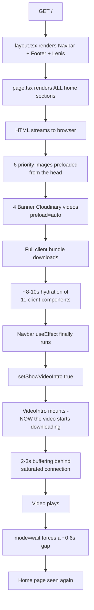
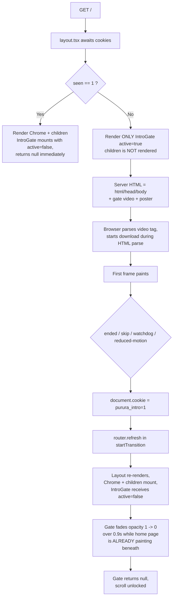

# Implementation Plan — Intro Video Gate

## 1. Objective

Make the intro video the **first and only** thing rendered on a first visit to the site, followed by a single seamless cross-fade into the home page. No home-page markup, no images, no videos, and no hydration may occur before the intro finishes.

### Acceptance criteria

| # | Criterion | How to verify |
|---|---|---|
| AC1 | Initial HTML for `/` contains **only** `<html>`, `<head>`, `<body>`, the grain overlay and the intro gate — no `<nav>`, no `<footer>`, no section markup | View Source (not Inspect) |
| AC2 | Zero requests to `/_next/image` and zero Cloudinary requests before the `ended` event | DevTools Network, filter + timeline |
| AC3 | No `<link rel="preload" as="image">` in the initial HTML | View Source |
| AC4 | First frame of video paints within **< 500 ms** of first byte on Slow 4G | Performance panel / filmstrip |
| AC5 | Total time from navigation start to interactive home page = intro duration **+ ≤ 1.2 s** | Performance panel |
| AC6 | No blank/black/beige gap between last video frame and home page | Visual |
| AC7 | Skip button, `Esc`, and `Space` all work at any point | Manual |
| AC8 | Hard watchdog: intro can never exceed `duration + 5 s` | Manual |
| AC9 | `prefers-reduced-motion: reduce` skips the intro entirely | DevTools emulation |
| AC10 | Site is fully usable if `intro.mp4` 404s or the CDN fails | Manual |

---

## 2. Current architecture (the thing being replaced)



### Defects being fixed

| ID | Defect | Location |
|---|---|---|
| D1 | Home page rendered unconditionally | `app/page.tsx:12` |
| D2 | `showVideoIntro` initialised to `false`, resolved only in `useEffect` + rAF | `components/layout/Navbar.tsx:64`, `:72-87` |
| D3 | `<video src>` attached only after `showVideoIntro` flips — download starts far too late | `components/intro/VideoIntro.tsx:100` |
| D4 | The "loading screen" is VideoIntro's own `!isVideoReady` beige pulse — no poster, no watchdog | `components/intro/VideoIntro.tsx:82` |
| D5 | Four concurrent Cloudinary HD downloads with `preload="auto"` | `components/home/Banner.tsx:176-179`, `:197` |
| D6 | Six `priority` images on `/`, four of them hidden or below the fold | see Section 5 |
| D7 | All home sections are `"use client"` + framer-motion → hydration cost | 11 components |
| D8 | `initial` opacity 0 + `whileInView` → empty shells pre-hydration | `DesignPhilosophy.tsx:334`, `PururaMapBasic.tsx:38` |
| D9 | `AnimatePresence mode="wait"` forces exit→enter gap | `components/layout/Navbar.tsx:191` |
| D10 | `transition` prop overrides the spread `fadeIn.transition` | `components/intro/VideoIntro.tsx:76-80` |
| D11 | `play()` rejection silently skips the intro | `components/intro/VideoIntro.tsx:37-40` |
| D12 | `sessionStorage` written only on the happy path | `components/intro/VideoIntro.tsx:44-51` |
| D13 | No scroll lock; Lenis can scroll the page behind the overlay | `components/layout/Navbar.tsx:107-126` |
| D14 | `BrandIntro` adds a 4.5 s cream animation on every route change — **out of scope for this plan; preserved** | `components/layout/Navbar.tsx:165-171`, `:199-204` |
| D16 | Nested `<main>` | `app/layout.tsx:87` + `app/page.tsx:15` |

---

## 3. Target architecture

**Chosen: Layout Gate.** The cookie is read in the root layout. When the visitor has not seen the intro, the layout renders **only** the gate — no Navbar, no Footer, no Lenis, no `children`.



### Why this beats middleware

| | Layout Gate | Middleware rewrite |
|---|---|---|
| Extra round-trip | 1 RSC refresh, **masked by the 0.9s fade** | 1 full navigation |
| Address bar | Stays `/` | Must `history.replaceState` to hide `/intro` |
| Revalidation correctness | Trivially correct | Rewrite + `router` tree mismatch risk |
| Files added | 1 | `middleware.ts` + intro route + rewrite logic |
| Navbar/Footer suppressed | Yes (they're inside `children` chrome) | Yes |
| Downsides | Opts every route into dynamic rendering | Same, plus rewrite edge cases |

> **Next 16 note:** `next@16.2.6` renames `middleware.ts` to `proxy.ts`. If you later prefer middleware, use `proxy.ts` (or keep `middleware.ts` and accept the deprecation warning). This plan does not require it.

### Why the gate must always be mounted

If `IntroGate` were conditionally rendered (`{!seen && <IntroGate />}`), `router.refresh()` would unmount it instantly and the fade would never run — you'd get a hard cut, which is exactly the current bug. By rendering it **always** and passing `active` as a prop, React preserves the component instance, so it can fade out while the freshly-mounted home page paints beneath it.

---

## 4. File change set

### New files

| Path | Purpose |
|---|---|
| `components/intro/IntroGate.tsx` | The gate + cross-fade overlay |
| `components/home/FullHome.tsx` | Extracted home page body (moved out of `app/page.tsx`) |
| `public/intro/poster.avif` | ~25 KB first-frame poster |
| `public/intro/poster.webp` | Fallback poster |

### Modified files

| Path | Change |
|---|---|
| `app/layout.tsx` | Head preloads; `await cookies()`; gate/chrome branch; remove nested `<main>` |
| `app/page.tsx` | Shrink to `<FullHome />` |
| `components/layout/Navbar.tsx` | Remove only the VideoIntro branch from the `AnimatePresence`; leave BrandIntro wiring untouched; remove `priority` on logo image |
| `components/home/Banner.tsx` | `preload="none"` until intro completes |
| `components/masterplan/MasterplanExplorer.tsx` | Remove 2x `priority`; delete duplicate image |
| `components/home/DesignPhilosophy.tsx` | Remove `priority` |
| `components/home/Philosophy.tsx` | Remove 2x `priority` |

### Deleted files

| Path | Reason |
|---|---|
| `components/intro/VideoIntro.tsx` | Replaced by `IntroGate`; stop importing it in `Navbar.tsx` |

---

## 5. Step-by-step implementation

### Step 0 — Branch and baseline

```bash
git checkout -b feat/intro-gate
npm run build && npm start
```

Record a baseline in the Performance panel on Slow 4G: FCP, LCP, and total bytes.

---

### Step 1 — Prepare the video assets (do this first, it's independent)

#### 1a. Verify `faststart`

If the `moov` atom is at the **end** of the file, the browser must download 100% of the file before painting frame 1. This alone produces a multi-second blank screen and cannot be fixed by hosting or architecture.

```bash
ffprobe -v trace -i public/intro/intro.mp4 2>&1 | findstr /C:"type:'moov'" /C:"type:'mdat'"
```

- `mdat` **before** `moov` -> **must re-encode**.
- `moov` before `mdat` -> already fine, skip to 1b.

#### 1b. Re-encode with faststart + two renditions + poster

```bash
# Desktop — 1080p, faststart
ffmpeg -i public/intro/intro.mp4 \
  -vf "scale=-2:1080" -c:v libx264 -crf 23 -preset slow -pix_fmt yuv420p \
  -movflags +faststart -c:a aac -b:a 128k public/intro/intro.1080.mp4

# Mobile — 720p, faststart
ffmpeg -i public/intro/intro.mp4 \
  -vf "scale=-2:720" -c:v libx264 -crf 26 -preset slow -pix_fmt yuv420p \
  -movflags +faststart -c:a aac -b:a 96k public/intro/intro.720.mp4

# Poster (first frame, tiny)
ffmpeg -i public/intro/intro.mp4 -vframes 1 -vf "scale=-2:1080" \
  -q:v 14 public/intro/poster.jpg
```

Keep `public/intro/intro.mp4` as the universal fallback source.

#### 1c. Ruff out the poster

The current file has no `poster`, so `VideoIntro` painted a flat `bg-void` (`#F8F3EA`) until the first frame decoded. The poster fixes this.

---

### Step 2 — Create `components/intro/IntroGate.tsx`

```tsx
"use client";

import { motion } from "framer-motion";
import { useRouter } from "next/navigation";
import { useCallback, useEffect, useRef, useState, useTransition } from "react";

const COOKIE_NAME = "purura_intro";
const COOKIE_MAX_AGE = 60 * 60 * 24;

/** Pick a rendition by viewport + connection quality. */
function pickSource(): string {
  if (typeof window === "undefined") return "/intro/intro.720.mp4";

  const conn = (
    navigator as Navigator & {
      connection?: { saveData?: boolean; effectiveType?: string };
    }
  ).connection;

  const slow =
    conn?.saveData === true ||
    conn?.effectiveType === "2g" ||
    conn?.effectiveType === "3g" ||
    conn?.effectiveType === "slow-2g";

  const small = window.innerWidth < 768;
  return slow || small ? "/intro/intro.720.mp4" : "/intro/intro.1080.mp4";
}

type IntroGateProps = {
  /** true  -> run the intro and hold the overlay opaque
   *  false -> the server has already revealed the page; fade out */
  active: boolean;
};

export default function IntroGate({ active }: IntroGateProps) {
  const router = useRouter();

  const videoRef = useRef<HTMLVideoElement | null>(null);
  const settledRef = useRef(false);
  const [gone, setGone] = useState(false);
  const [ready, setReady] = useState(false);
  const [, startTransition] = useTransition();

  useEffect(() => {
    if (active) {
      settledRef.current = false;
      setGone(false);
      setReady(false);
    }
  }, [active]);

  /* COMPLETE - runs on EVERY exit path (AC10, fixes D12/D11) */
  const complete = useCallback(() => {
    if (settledRef.current) return;
    settledRef.current = true;

    document.cookie =
      `${COOKIE_NAME}=1; path=/; max-age=${COOKIE_MAX_AGE}; samesite=lax`;

    window.dispatchEvent(new Event("purura:intro-done"));

    // Reveal. Overlay stays opaque until the new tree commits.
    startTransition(() => {
      router.refresh();
    });
  }, [router]);

  /* WATCHDOGS (AC8, AC9) */
  useEffect(() => {
    if (!active) return;

    if (window.matchMedia("(prefers-reduced-motion: reduce)").matches) {
      complete();
      return;
    }

    const video = videoRef.current;
    if (!video) {
      const t = window.setTimeout(() => complete(), 45_000);
      return () => window.clearTimeout(t);
    }

    let hardStopTimer = window.setTimeout(() => complete(), 45_000);

    const onMeta = () => {
      const d = Number.isFinite(video.duration) ? video.duration : 30;
      window.clearTimeout(hardStopTimer);
      hardStopTimer = window.setTimeout(() => complete(), (d + 5) * 1000);
    };

    video.addEventListener("loadedmetadata", onMeta, { once: true });

    return () => {
      window.clearTimeout(hardStopTimer);
      video.removeEventListener("loadedmetadata", onMeta);
    };
  }, [active, complete]);

  /* VIDEO LIFECYCLE */
  useEffect(() => {
    if (!active) return;
    const video = videoRef.current;
    if (!video) return;

    const onReady = () => setReady(true);
    const onEnded = () => complete();
    const onError = () => complete();

    video.addEventListener("canplay", onReady);
    video.addEventListener("ended", onEnded);
    video.addEventListener("error", onError);

    video.play().catch(() => setReady(true));

    return () => {
      video.removeEventListener("canplay", onReady);
      video.removeEventListener("ended", onEnded);
      video.removeEventListener("error", onError);
    };
  }, [active, complete]);

  /* SKIP - button, Esc, Space (AC7) */
  useEffect(() => {
    if (!active) return;

    const onKey = (e: KeyboardEvent) => {
      if (e.key === "Escape" || e.key === " " || e.key === "Spacebar") {
        e.preventDefault();
        complete();
      }
    };

    window.addEventListener("keydown", onKey);
    return () => window.removeEventListener("keydown", onKey);
  }, [active, complete]);

  /* SCROLL LOCK (D13) */
  useEffect(() => {
    if (!active) return;

    if (!("scrollRestoration" in history)) return;
    history.scrollRestoration = "manual";

    const html = document.documentElement;
    const prev = html.style.overflow;
    html.style.overflow = "hidden";
    if (window.scrollY !== 0) window.scrollTo(0, 0);

    return () => {
      html.style.overflow = prev;
      window.scrollTo(0, 0);
      window.requestAnimationFrame(() => window.scrollTo(0, 0));
    };
  }, [active]);

  /* CROSS-FADE - the "slick" moment.
     `active` flips to false only AFTER router.refresh() commits,
     so the home page is already painting underneath us. */
  useEffect(() => {
    if (active || gone) return;
    const t = window.setTimeout(() => setGone(true), 900);
    return () => window.clearTimeout(t);
  }, [active, gone]);

  if (gone) return null;

  return (
    <motion.div
      role="dialog"
      aria-label="Purura introduction"
      aria-modal="true"
      data-lenis-prevent
      data-intro-gate
      className="fixed inset-0 z-[9999] flex items-center justify-center"
      style={{ background: "var(--color-void)", opacity: active ? 1 : 0 }}
      initial={false}
      animate={{ opacity: active ? 1 : 0 }}
      transition={{ duration: 0.9, ease: [0.16, 1, 0.3, 1] }}
      onClick={complete}
    >
      <motion.img
        src="/intro/poster.avif"
        alt=""
        aria-hidden="true"
        className="absolute inset-0 h-full w-full object-cover"
        initial={false}
        animate={{ opacity: ready ? 0 : 1 }}
        transition={{ duration: 0.5, ease: "easeOut" }}
      />

      <video
        ref={videoRef}
        className="absolute inset-0 h-full w-full object-cover"
        style={{
          opacity: ready ? 1 : 0,
          transition: "opacity 320ms ease-out",
        }}
        poster="/intro/poster.avif"
        preload="auto"
        autoPlay
        muted
        playsInline
        disableRemotePlayback
        src={pickSource()}
      />

      <button
        type="button"
        onClick={(e) => {
          e.stopPropagation();
          complete();
        }}
        className="absolute bottom-6 right-6 z-10 font-mono text-[10px] uppercase tracking-[0.28em] text-bone/45 transition-colors hover:text-bone"
      >
        Skip
      </button>
    </motion.div>
  );
}
```

> **Critical detail:** `animate={{ opacity: active ? 1 : 0 }}` MUST be driven by the `active` prop. A hard-coded `animate={{ opacity: 0 }}` would fade the overlay out immediately on mount and reintroduce D9 (the hard cut). This is the single most important detail in the plan.

---

### Step 3 — Rewire `app/layout.tsx`

```tsx
import type { Metadata } from "next";
import Script from "next/script";
import { cookies } from "next/headers";
import {
  Space_Grotesk,
  JetBrains_Mono,
  Playfair_Display,
} from "next/font/google";
import "./globals.css";
import Navbar from "@/components/layout/Navbar";
import Footer from "@/components/layout/Footer";
import SmoothScroll from "@/components/layout/SmoothScroll";
import WhatsAppButton from "@/components/layout/WhatsAppButton";
import ScrollProgress from "@/components/ScrollProgress";
import { ThemeProvider } from "@/components/ThemeProvider";
import { ToastProvider } from "@/components/ui/Toast";
import IntroGate from "@/components/intro/IntroGate";

const display = Space_Grotesk({
  subsets: ["latin"],
  weight: ["300", "400", "500", "700"],
  variable: "--font-display",
  display: "swap",
});

const mono = JetBrains_Mono({
  subsets: ["latin"],
  weight: ["400", "500"],
  variable: "--font-mono",
  display: "swap",
});

const serif = Playfair_Display({
  subsets: ["latin"],
  weight: ["400", "500", "600", "700"],
  variable: "--font-serif",
  display: "swap",
});

export const metadata: Metadata = {
  title: "Purura — The Living Archipelago",
  description:
    "A Regenerative Waterfront Futuristic Resort Integrating Landscape, Architecture, and Intelligent Infrastructure",
};

export default async function RootLayout({
  children,
}: {
  children: React.ReactNode;
}) {
  const introSeen = (await cookies()).get("purura_intro")?.value === "1";

  return (
    <html
      lang="en"
      className={`${display.variable} ${mono.variable} ${serif.variable}`}
    >
      <head>
        {/* Highest-priority network requests on the site */}
        <link
          rel="preload"
          href="/intro/intro.720.mp4"
          as="video"
          type="video/mp4"
          fetchPriority="high"
        />
        <link
          rel="preload"
          href="/intro/poster.avif"
          as="image"
          type="image/avif"
          fetchPriority="high"
        />
        {/* Fallback for browsers that ignore as="video" */}
        <link rel="prefetch" href="/intro/intro.1080.mp4" as="video" />

        <Script
          id="theme-cleanup"
          strategy="beforeInteractive"
          dangerouslySetInnerHTML={{
            __html: `
        (function() {
          try {
            if (!localStorage.getItem('theme-cleanup-done')) {
              localStorage.removeItem('theme-default');
              localStorage.removeItem('theme-session');
              localStorage.setItem('theme-cleanup-done', '1');
              document.documentElement.setAttribute('data-theme', 'light');
            }
          } catch (e) {}
        })();
      `,
          }}
        />
      </head>

      <body>
        {/* Always mounted so it can cross-fade after the refresh. */}
        <IntroGate active={!introSeen} />

        {/* ONLY when the intro is done do we ship the entire site. */}
        {introSeen ? (
          <ToastProvider>
            <ThemeProvider>
              <SmoothScroll>
                <div className="grain-overlay" />
                <ScrollProgress />
                <Navbar />
                <div id="main-content" className="relative">
                  {children}
                </div>
                <Footer />
                <WhatsAppButton />
              </SmoothScroll>
            </ThemeProvider>
          </ToastProvider>
        ) : null}
      </body>
    </html>
  );
}
```

**What changed and why**

| Change | Reason |
|---|---|
| `<head>` video + poster preloads | Starts the download during HTML parse, before JS (fixes D3) |
| `await cookies()` | Server knows whether to gate, so no flash is possible (fixes D1, D2) |
| `{introSeen ? <Chrome/> : null}` | Home page is **never in the HTML** on first visit |
| `<IntroGate>` outside the ternary | Survives the refresh so it can fade (prevents D9) |
| `<main>` -> `<div id="main-content">` | Fixes nested `<main>` (D16) |
| `SmoothScroll` inside the branch | Lenis does not run during the intro (fixes D13) |

**Trade-off to accept:** calling `cookies()` opts every route into dynamic rendering. For a marketing site with no ISR requirements this is correct. Do not add `export const dynamic = "force-static"`.

---

### Step 4 — Extract `components/home/FullHome.tsx`

Move the body of `app/page.tsx` verbatim, minus the `<main>` wrapper (now provided by the layout as `<div id="main-content">`).

```tsx
import Philosophy from "./Philosophy";
import TheResort from "./TheResort";
import MasterplanExplorer from "@/components/masterplan/MasterplanExplorer";
import Investment from "./Investment";
import SectionNav from "@/components/layout/SectionNav";
import ScrollColorTransition from "./ScrollColorTransition";
import Banner from "./Banner";
import DesignPhilosophy from "./DesignPhilosophy";
import PururaMapBasic from "@/components/map/PururaMapBasic";

const SECTION_NAV_ITEMS = [
  { label: "Philosophy", href: "#philosophy" },
  { label: "Design Philosophy", href: "#design-philosophy" },
  { label: "The Resort", href: "#the-resort" },
  { label: "Masterplan", href: "#masterplan-explorer" },
  { label: "Investment", href: "#investment" },
];

export default function FullHome() {
  return (
    <>
      <ScrollColorTransition />
      <SectionNav items={SECTION_NAV_ITEMS} />
      <Banner />
      <Philosophy />
      <DesignPhilosophy />
      <TheResort />
      <Investment />
      <MasterplanExplorer />
      <PururaMapBasic />
    </>
  );
}
```

```tsx
// app/page.tsx
import FullHome from "@/components/home/FullHome";

export default function HomePage() {
  return <FullHome />;
}
```

> **Perf:** the `SectionNav` `items` array is currently recreated on every render, which makes the `useEffect([items])` in `components/layout/SectionNav.tsx` tear down and rebuild the `IntersectionObserver` every time. Hoisting it to module scope fixes that.

---

### Step 5 — Strip the priority hints (D6)

All six must lose `priority`. None are in the first viewport.

| File | Line(s) | Action |
|---|---|---|
| `components/masterplan/MasterplanExplorer.tsx` | 136-144 | Remove `priority` **and delete this entire `<motion.div>`** — it is a duplicate `Overall 11.png` rendered twice with different `object-fit`. Keep only the `object-contain` instance at 155-163. |
| `components/masterplan/MasterplanExplorer.tsx` | 155-163 | Remove `priority` |
| `components/home/DesignPhilosophy.tsx` | 364-371 | Remove `priority` |
| `components/home/Philosophy.tsx` | 266-273 | Remove `priority` |
| `components/home/Philosophy.tsx` | 171-178 | Remove `priority={index === 0}` -> `priority={false}` |
| `components/layout/Navbar.tsx` | 460-467 | Remove `priority` (it sits inside `hidden ... lg:block`) |

**Restore exactly one priority** — the Banner's LCP candidate — so the reveal isn't into an empty hero:

```tsx
// components/home/Banner.tsx — around line 200
<Image
  src={videoPosters[activePointer]}
  alt=""
  fill
  priority
  quality={75}
  sizes="100vw"
  className="object-cover"
/>
```

---

### Step 6 — Stop Banner pre-loading four HD videos

```tsx
// components/home/Banner.tsx

// 1. Track whether the intro has finished.
const [introDone, setIntroDone] = useState(
  typeof document !== "undefined" &&
    document.cookie.includes("purura_intro=1")
);

// 2. Replace getPreload()
const getPreload = () => {
  if (!introDone) return "none";          // was "auto"
  if (isMobile || prefersReducedData) return "metadata";
  return "auto";
};

// 3. Only mount the real <video> elements after the reveal.
{videosMounted &&
  Object.entries(backgroundVideos).map(([id, src]) => (
    <motion.video key={id} src={src} poster={videoPosters[id]} ... />
  ))}

// 4. Listen for the reveal
useEffect(() => {
  const arm = () => setIntroDone(true);
  window.addEventListener("purura:intro-done", arm);
  const t = window.setTimeout(arm, 4000); // safety net
  return () => {
    window.removeEventListener("purura:intro-done", arm);
    window.clearTimeout(t);
  };
}, []);
```

`IntroGate` dispatches the event at the moment of `complete()`:

```tsx
window.dispatchEvent(new Event("purura:intro-done"));
```

Meanwhile the poster `<Image>` renders immediately at full opacity, so the hero looks correct the instant the overlay lifts.

---

### Step 7 — Purge the old mechanism

**`components/layout/Navbar.tsx`**

Delete:
- `import VideoIntro from "@/components/intro/VideoIntro";`
- `const [showVideoIntro, setShowVideoIntro] = useState<boolean>(false);`
- The `sessionStorage` / `requestAnimationFrame` mount effect

Keep everything else in `Navbar.tsx` untouched — `BrandIntro`, `showBrandIntro`, `hasMounted`, `hasNavigated`, and the `useLayoutEffect` pathname watcher all stay.

Then change `return ( <>` to `return (` and remove the now-orphaned closing `</>`.

**Delete the file**

```bash
git rm components/intro/VideoIntro.tsx
```

---

### Step 8 — Defer the two heaviest below-the-fold islands (D7)

```tsx
// components/home/FullHome.tsx
import dynamic from "next/dynamic";

const MasterplanExplorer = dynamic(
  () => import("@/components/masterplan/MasterplanExplorer"),
  { ssr: false, loading: () => <div className="h-screen bg-void" /> }
);
const PururaMapBasic = dynamic(
  () => import("@/components/map/PururaMapBasic"),
  { ssr: false, loading: () => <div className="h-[80vh] bg-void" /> }
);
```

> `PururaMapBasic` embeds a Google Maps iframe — nothing above the fold depends on it. This removes a third-party frame from the critical path entirely.

---

## 6. Optional Phase 2 — Cloudinary

**Do not do this before the gate is shipped and measured.** See Section 8.

If you proceed, the wins are codec negotiation and a generated poster — roughly **100-300 ms**, not 8-10 seconds.

```tsx
const INTRO_CLOUDINARY =
  "https://res.cloudinary.com/<cloud>/video/upload/f_auto,q_auto:eco/" +
  "intro_<version>.mp4";

<video
  src={INTRO_CLOUDINARY}
  poster={`https://res.cloudinary.com/<cloud>/video/upload/so_0,f_avif,q_auto:eco/intro_<version>.jpg`}
  ...
/>
```

| Concern | Mitigation |
|---|---|
| Third-party outage on first impression | Keep `onError` -> `complete()` and a local fallback in `src` |
| Free-tier limits (~25 GB/mo delivery) | Monitor; add `q_auto` + `f_auto` to cut bytes |
| Perceived latency | Accept the extra RTT; do not make it the only source during rollout |
| Benefit | `f_auto` -> AV1/VP9, ~30-50% smaller; free poster/thumbnail transforms |

---

## 7. Execution order

```mermaid
gantt
    dateFormat X
    axisFormat %s
    section Assets
    Verify faststart, re-encode, poster        :a1, 0, 1
    section Gate
    Create IntroGate.tsx                       :b1, after a1, 2
    Rewire layout.tsx                          :b2, after b1, 1
    section Page
    Extract FullHome, hoist SectionNav items   :c1, after b2, 1
    section Bandwidth
    Strip 6 priority props, dedupe Masterplan  :d1, after c1, 1
    Gate Banner videos behind intro-done       :d2, after d1, 1
    section Cleanup
    Purge VideoIntro                             :e1, after d2, 1
    section Perf
    Dynamic-import Masterplan and Map          :f1, after e1, 1
    section Verify
    Build, throttle, Lighthouse, compare       :g1, after f1, 1
```



Steps 5-7 are independent of each other and can run in any order.

---

## 8. Verification protocol

```bash
npm run build
npm start        # NEVER verify this in `next dev` — HMR and StrictMode
                 # double-effects make the 8-10s stall unrepresentative
```

1. **View Source** on `/` in a fresh incognito window -> confirm no `<nav>`, no `<footer>`, no `/_next/image` preloads (AC1, AC3)
2. DevTools -> Network -> throttle **Slow 4G** -> reload -> confirm `intro.*.mp4` is one of the first 3 requests and zero `/_next/image` before `ended` (AC2, AC4)
3. Performance panel -> record `intro.*.mp4` first frame in the filmstrip (AC4)
4. Timing: `intro duration + <= 1.2s` to interactive (AC5)
5. Watch the video -> home transition frame by frame at 0.25x speed — no gap (AC6)
6. Press `Esc` at t=1s, t=3s; click **Skip**; reload — always lands on the home page (AC7)
7. DevTools -> Network -> block `/intro/*` and reload — home page must still appear (AC8, AC10)
8. DevTools -> Rendering -> **Emulate prefers-reduced-motion: reduce** -> intro must not play (AC9)
9. Reload mid-scroll -> must land at top, not mid-page (D13)
10. Click through `/experience`, `/amenities`, `/faq` — **BrandIntro still plays** with its 4.5 s wordmark animation (D14 preserved)
11. Lighthouse before/after: record LCP, TBT, total transfer weight

---

## 9. Risk register

| Risk | Likelihood | Mitigation |
|---|---|---|
| The fade is implemented wrong and a hard cut returns | Medium | The `animate={{ opacity: active ? 1 : 0 }}` rule in Step 2; verify AC6 frame-by-frame |
| `cookies()` in root layout breaks a route's static generation | Low | Expected and accepted; do not add `force-static` |
| `ssr: false` dynamic imports cause a hydration warning in some routes | Low | These components are already `"use client"` |
| `intro.mp4` lacks `faststart` and is not re-encoded | **High if unverified** | Step 1a is a gate — do not proceed past it without checking |
| Removing the duplicate `MasterplanExplorer` image changes layout | Low | It is an exact duplicate at `inset-0`; compare before/after |
| Nav loader regression — removing VideoIntro branch breaks BrandIntro | Low | Verify Step 7 only removes the VideoIntro branch; BrandIntro state and `useLayoutEffect` must remain |
| Cloudinary added too early and masks a real regression | Medium | Ship Sections 1-8, measure, then decide |

---

## 10. Rollback

```bash
git checkout main
git branch -D feat/intro-gate
```

The change is isolated to a single branch and touches no data, no API routes, and no admin surface. `app/api/admin/*` and `app/admin/roi/*` are untouched.

---

## 11. Expected outcome

| Metric | Before | After (target) |
|---|---|---|
| HTML transferred for first paint | ~200 KB+ (full home page) | ~4 KB (gate only) |
| Requests before `ended` | 11+ (6 images, 4 videos, font, JS) | 2-3 (video, poster, CSS) |
| Blank/stale period | 8-10 s | < 0.5 s to first video frame |
| Reveal gap | ~0.6 s black/beige | 0 s (true cross-fade) |
| Home page JS evaluated during intro | ~1.2 MB, fully hydrated | 0 |

---

*Prepared from the first-load inspection of `app/layout.tsx`, `app/page.tsx`, `components/layout/Navbar.tsx`, `components/intro/VideoIntro.tsx`, `components/home/Banner.tsx`, `components/home/Philosophy.tsx`, `components/home/DesignPhilosophy.tsx`, `components/masterplan/MasterplanExplorer.tsx`, `components/map/PururaMapBasic.tsx`, `components/layout/SectionNav.tsx` and `app/globals.css`.*
